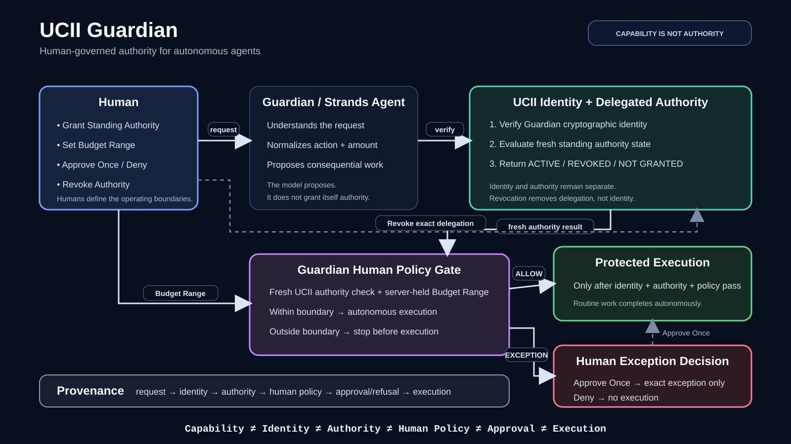

# UCII Guardian

> **Capability is not authority.**

**UCII Guardian is a human-governed authority agent built with AWS Strands Agents. It lets autonomous AI work without giving it unlimited permission to act.**

**Demo video:** [Watch the UCII Guardian demo on YouTube](https://youtu.be/jlVy2hGfDyY)

Humans define the operating boundaries. Guardian works autonomously inside them. When a request crosses a human-defined boundary, Guardian stops before consequential execution and asks for an explicit decision.

Built for the **2026 Agents for Humans Hackathon — Professional Agents track**.



## The problem

AI agents are becoming capable enough to make decisions and take real actions. Capability alone, however, does not answer the questions that matter when an agent acts on someone's behalf:

- **Who is this agent?**
- **What has it actually been authorized to do?**
- **How much economic authority has the human granted it?**
- **What happens when a request falls outside that boundary?**
- **Can the human revoke authority without destroying the agent's identity?**
- **Can we later prove why an action did or did not happen?**

Guardian treats those as separate authority problems rather than asking the language model to decide its own permissions.

## What Guardian does

Guardian demonstrates a complete human-governed authority lifecycle:

1. A human grants Guardian **bounded standing authority**.
2. The human sets a **Budget Range** for autonomous economic action.
3. Guardian uses **AWS Strands Agents** to understand the request and normalize the proposed action.
4. **UCII** independently verifies Guardian's identity and evaluates its current delegated authority.
5. Guardian independently applies the server-held human budget policy.
6. Routine work inside both boundaries executes autonomously.
7. Work outside the human budget stops before execution and offers **Approve Once** or **Deny**.
8. **Approve Once** permits only that exact exception; it does not increase the budget or broaden standing authority.
9. The human can **Revoke Authority** while Guardian's cryptographic identity remains intact.
10. A fresh attempt after revocation is denied even when the same request was previously allowed.

The governing rule is simple:

> **Guardian may reason about what should happen, but it may never manufacture permission to make it happen.**

## The key demonstration

With a human-selected Budget Range of **$111.02**:

| Request | UCII authority | Human policy | Result |
| --- | --- | --- | --- |
| Purchase a printer cartridge for **$35** | ACTIVE / ALLOW | Within range | **Executes autonomously** |
| Purchase a printer cartridge for **$150** | ACTIVE / ALLOW | Over range | **Stops before execution → Approve Once** |
| Purchase a printer cartridge for **$175** | ACTIVE / ALLOW | Over range | **Stops before execution → Deny → No execution** |
| Same **$35** request after revocation | REVOKED / DENY | Within range | **No execution** |

The final comparison is the central proof:

> **Same Guardian. Same verified identity. Same request. Same budget. Different authority state — different execution outcome.**

Revocation removes the delegated authority. It does not erase the agent's identity.

## Architecture

Guardian deliberately separates domains that autonomous systems can otherwise blur together:

**Capability ≠ Identity ≠ Authority ≠ Human Policy ≠ Approval ≠ Execution**

### AWS Strands Agents

Strands owns the agentic reasoning boundary. Guardian's Strands agent interprets human intent and produces a structured `ActionRequest`. It has **no execution tools and no authority-granting tools**. The model is explicitly prevented from treating identity as authorization.

### UCII

UCII is authoritative for Guardian's cryptographic identity, credentials, delegated authority state, authorization, and revocation. Guardian performs fresh authority evaluation before consequential action rather than trusting model output or stale permission.

### Guardian human policy

Guardian maintains the human-selected Budget Range on the server side. The browser control is not itself authoritative, and the model cannot change the budget. The budget is a per-request autonomous spending ceiling from **$0.00 to $5,000.00**, with **$0.00 as the fail-closed startup default**.

### Protected execution

The consequential executor is structurally downstream of the authority and policy checks. A request cannot reach protected execution merely because the model proposed it.

### Human exception handling

An over-budget request stops before execution. The human may approve that exact action once or deny it. One-time approval does not silently become standing authority.

### Revocation

Standing authority is independently revocable. After revocation, Guardian retains its verified identity but a fresh authority check prevents the previously permitted action from executing.

### Provenance

Guardian records the meaningful lifecycle so the outcome can be explained: request received, identity verified, authority checked, authorization state, human decision where applicable, execution or refusal, and revocation.

## Why this matters

A useful autonomous agent should not require a human click for every routine task. But removing human involvement entirely can turn capability into uncontrolled authority.

Guardian demonstrates a middle path:

> **Humans define the operating boundaries. Agents act autonomously inside them.**

Budget Range is one visible example of the broader model. The same human-governed pattern can apply to operational scope, tools, vendors, quantities, data access, geography, time, or other consequential boundaries without making the AI model the source of permission.

A familiar analogy is an employee with a corporate card: identity, role, spending authority, limits, exception handling, auditability, and revocation are distinct controls. Guardian brings that authority model to autonomous AI.

## Security and authority invariants

Guardian is designed around several fail-closed rules:

- An external or model-generated request is **not authority**.
- A verified identity is **not permission to act**.
- The language model cannot grant itself authority.
- Standing authority and one-time human approval are different things.
- Authorization and human economic policy are independently enforced.
- Revocation targets delegated authority rather than destroying identity.
- A revoked delegation is not reactivated; equivalent future permission requires a fresh grant.
- Consequential execution requires the protected authority path.
- Provenance records what happened without becoming a source of authority itself.

See [`docs/guardian-contract.md`](docs/guardian-contract.md) for the governing authority contract.

## Technology

- **Python 3.11+**
- **AWS Strands Agents** for agentic reasoning and structured action normalization
- **UCII SDK** for identity and delegated authority operations
- **Starlette + Uvicorn** for the human-facing Guardian interface
- **Post-quantum cryptographic support** through UCII/liboqs
- Self-hosted authority, custody, policy, execution, and provenance boundaries

Guardian's UCII SDK dependency is pinned to the exact UCII commit used for the submission build.

## Validation

Final submission hardening completed from the synchronized Guardian build:

```text
272 passed, 2 warnings in 4.95s
```

The two warnings are dependency-version/deprecation warnings and do not represent failing Guardian tests.

A final startup smoke test also verified:

```text
HTTP STATUS: 200
GUARDIAN PAGE MARKER=PASS
```

The live authority demonstration has additionally exercised the complete path: grant standing authority, autonomous in-budget execution, over-budget escalation, Approve Once, Deny, revocation, and post-revocation refusal.

## Development setup

Clone the repository and create a Python 3.11+ virtual environment, then install the project with development dependencies:

```text
python -m venv .venv
.venv\Scripts\python -m pip install -e ".[dev]"
```

Run the test suite:

```text
.venv\Scripts\python -m pytest -q
```

Run the Guardian web application:

```text
.venv\Scripts\python -m uvicorn ucii_guardian.web:app --host 127.0.0.1 --port 8000
```

Guardian's live protected authority lifecycle requires a provisioned UCII deployment and Guardian identity/custody configuration. The repository's tests exercise the boundaries without requiring judges to mutate a production UCII deployment.

## Judge/Test Mode

Guardian includes a resettable **Judge/Test Mode** for repeatable evaluation of the bounded-authority lifecycle without modifying production UCII delegated authority.

> **IMPORTANT — JUDGE/TEST MODE IS INTENTIONALLY SCOPE-BOUNDED**
>
> Guardian is **not an unrestricted shopping agent**. This demonstration delegates only the `guardian.purchase.office_supply` operation. Being below the Budget Range does **not** create permission to purchase arbitrary goods or services.
>
> Autonomous execution requires **both** valid delegated operation scope **and** compliance with the human-controlled economic policy. Requests outside the office-supply operation are intentionally refused. **That is a security property, not a broken purchasing function.**

Judge/Test Mode isolates the delegated-authority lifecycle while keeping Guardian identity verification real. Interactive replay therefore requires a provisioned Guardian identity/custody environment; private signing custody is intentionally not distributed in this public repository.

The public tests verify Judge/Test isolation, production-boundary preservation, reset behavior, grant/revoke behavior, and post-revocation refusal without requiring access to Guardian private signing material.

### Start Judge/Test Mode

In a provisioned Guardian environment:

```powershell
$env:UCII_GUARDIAN_MODE = "judge-test"
.venv\Scripts\python -m uvicorn ucii_guardian.web:app --host 127.0.0.1 --port 8000
```

Open `http://127.0.0.1:8000`.

### Canonical Judge/Test replay

1. Click **Reset Demo/Test**.
2. Click **Grant Standing Authority**.
3. Set **Budget Range** to **$111.02**.
4. Submit: `Purchase 2 boxes of blue ballpoint pens for a maximum total price of $35.`
   - Expected: **ALLOW → Completed**.
5. Submit: `Purchase 2 boxes of blue ballpoint pens for a maximum total price of $150.`
   - Expected: **Awaiting human decision**.
6. Click **Approve Once**.
   - The exact exception executes; the Budget Range remains **$111.02**.
7. Submit: `Purchase 3 boxes of blue ballpoint pens for a maximum total price of $175.`
   - Expected: **Awaiting human decision** again.
8. Click **Deny**.
   - Expected: **No execution**.
9. Click **Revoke Authority**.
   - Guardian remains cryptographically verified, but isolated authority becomes `REVOKED`.
10. Submit the original `$35` request again.
    - Expected: **DENY → No execution**.
11. Click **Reset Demo/Test** to return to the known initial state.

> **Same Guardian. Same verified identity. Same request. Same budget. Different authority state — different execution outcome.**

## Demo and submission artifacts

- [`docs/submission-demo-script.md`](docs/submission-demo-script.md) — locked five-minute judge-facing demo sequence
- [`docs/guardian-architecture.svg`](docs/guardian-architecture.svg) — submission architecture diagram
- [`docs/guardian-contract.md`](docs/guardian-contract.md) — authority invariants
- [`docs/roadmap.md`](docs/roadmap.md) — bounded implementation history

## Prior-work disclosure

**UCII Guardian is the new hackathon project.** It was built as the human-governed autonomous agent and authority experience for this event.

Guardian integrates with **UCII (Universal Cryptographic Identity Infrastructure)**, which is pre-existing infrastructure developed before the hackathon. UCII provides the underlying identity, credential, authorization, delegated-authority, revocation, and cryptographic trust capabilities that Guardian consumes through its public SDK/API boundary.

The distinction is intentional: Guardian does not claim that the underlying UCII platform was created during the hackathon. The hackathon work is the Guardian agent, its Strands orchestration, human authority controls, protected workflow, exception handling, execution boundary, provenance integration, web experience, tests, and the UCII extensions required to expose the bounded Guardian authority lifecycle through the public integration boundary.

## Scope

Guardian is intentionally focused. The hackathon build is not a general-purpose assistant, workflow builder, multi-agent swarm, marketplace, identity provider, or replacement for UCII. The narrow scope lets the submission demonstrate one complete consequential-action authority lifecycle clearly and verifiably.

## Hackathon

**Agents for Humans Hackathon — Professional Agents**  
**Submission deadline:** September 14, 2026

> **UCII Guardian is not designed to prevent autonomous AI. It is designed to make autonomous AI governable.**
